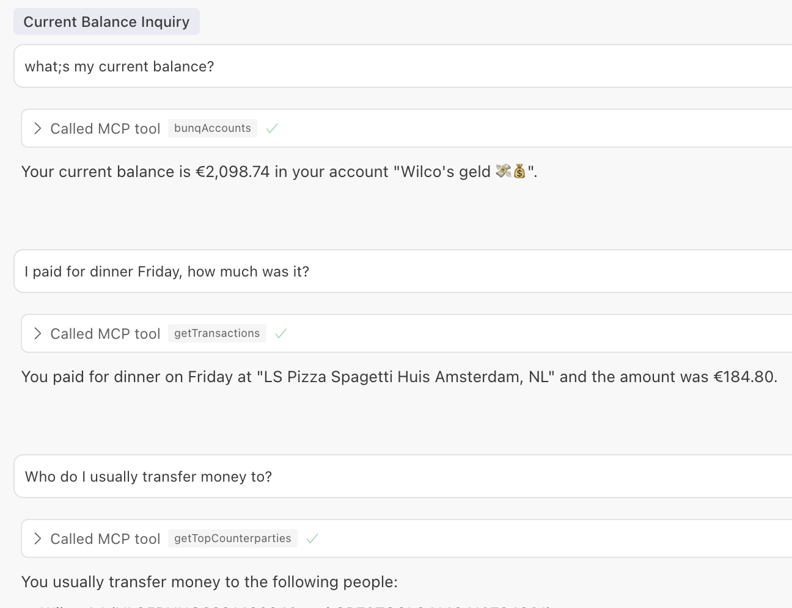

# Bunq MCP

A Model Context Protocol server for Bunq.



- Uses Cloudflare libraries to handle the OAuth flow and the Bunq API.
- Has not been deployed to production (Cloudflare Workers), but should be possible.
  - TODO is a way to load the public/private key pair from Cloudflare secrets / R2.

See README.OLD.md for original instructions from the Cloudflare OAuth template.

## Setup

1. Create `.dev.vars` file in the root directory with the following content:

```sh
# When set to 1 the public/private key pair in this repo is used.
IS_DEVELOPMENT=1

COOKIE_ENCRYPTION_KEY=<random-string>>

# Create OAuth client in the Bunq app
BUNQ_CLIENT_ID=
BUNQ_CLIENT_SECRET=
```

2. Start development server

```sh
npm run dev
```

3. Setup MCP configuration

```json
{
  "mcpServers": {
    "bunq-mcp": {
      "command": "npx",
      "args": ["mcp-remote", "http://localhost:8788/sse"]
    }
  }
}
```

## Keys

To generate keys:

```sh
openssl genrsa -out bunq-installation.key && openssl rsa -in bunq-installation.key -outform PEM -pubout -out bunq-installation.pub
```

## Limitations

- It's not possible to create payments using the OAuth flow. Only draft payments can be created.

```json
{ "Error": [{ "error_description": "Not enough permissions to create payment." }] }
```
